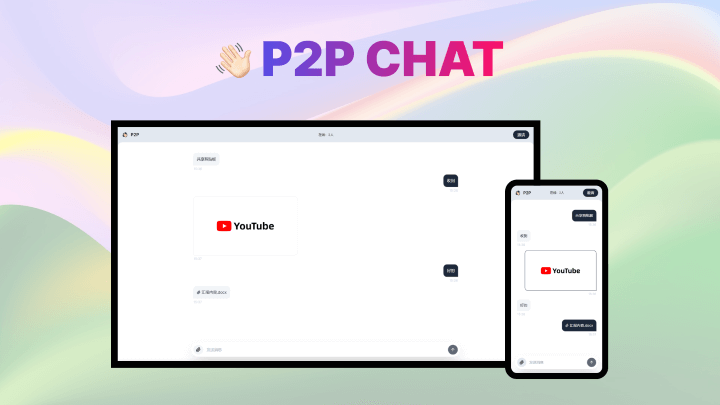

<div align="center">

<h1 >
    <span></span><br>
    <span>P2P Chat</span>
</h1>

基于next.js+socket.io实现的在线P2P聊天



</div>

## 安装

```bash
git clone https://github.com/shulkme/p2p-chat.git
cd p2p-chat
npm install
```

## 开发

```bash
npm run dev
```

## 部署

```bash
npm run build
npm run start
```

